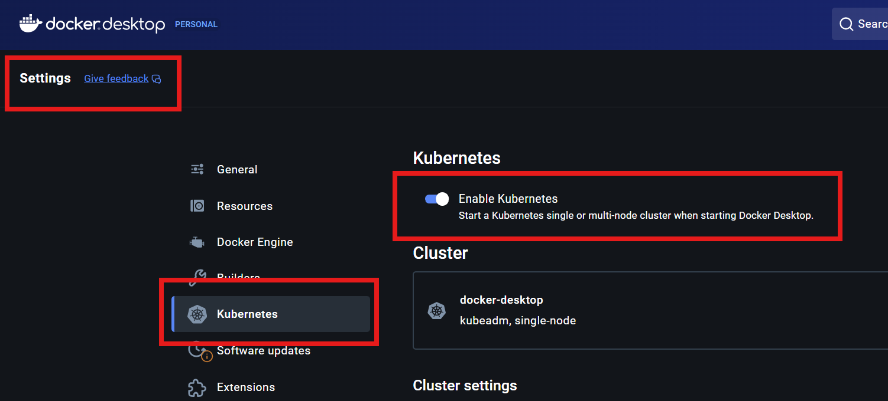
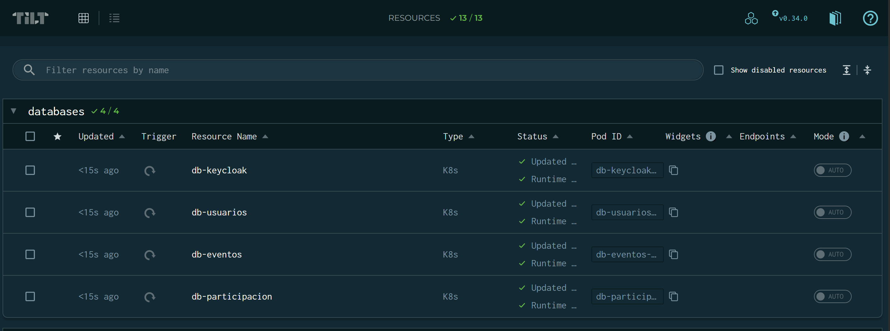
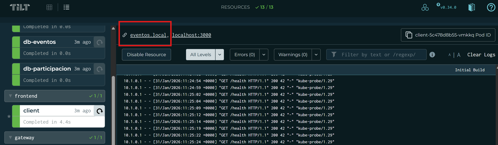

# Plataforma de Gestion de Eventos - Cluster Kubernetes

Plataforma distribuida de gestion de eventos de juegos de 
cartas y de mesa. Construida con una arquitectura de microservicios sobre Kubernetes. El sistema permite la creacion, moderacion e inscripcion a eventos, con autenticacion centralizada y comunicacion asincrona entre servicios.

Proyecto academico para la asignatura de **Modelado de Sistemas Distribuidos - UVA**.

El propósito de este cluster es ser un prototipo bien documentado que beneficie al modelado 
de este sistema.

## Tecnologias

| Componente | Tecnologia | Proposito |
|------------|------------|-----------|
| Orquestacion | Kubernetes (Docker Desktop) | Despliegue y gestion de contenedores |
| Dev Environment | Tilt | Hot-reload y orquestacion local de desarrollo |
| API Gateway | NGINX | Reverse proxy, enrutamiento y CORS |
| Identity Provider | Keycloak 23.0 | Autenticacion OAuth2/OIDC |
| Base de datos | PostgreSQL 15 | Persistencia (una instancia por servicio) |
| Mensajeria | RabbitMQ 3.12 | Colas de mensajes entre eventos y participacion |
| Frontend | React | Cliente web SPA |
| Manifiestos | Kustomize | Gestion declarativa de recursos K8s |
| Red | NetworkPolicies | Segmentacion y control de trafico entre pods |


## Estructura de Directorios

```
k8s/
├── Tiltfile                          # Orquestacion de desarrollo local
├── namespace.yaml                    # Namespace: eventos-system
├── kustomization.yaml                # Despliegue con Kustomize
├── README.md
│
├── configmaps/
│   ├── secrets.yaml                  # Secrets (credenciales de BDs, RabbitMQ, Keycloak)
│   └── api-gateway-config.yaml       # ConfigMap del gateway + NetworkPolicies
│
├── databases/
│   ├── postgres-keycloak.yaml        # BD Keycloak (1 GB)
│   ├── postgres-usuarios.yaml        # BD Usuarios (1 GB)
│   ├── postgres-eventos.yaml         # BD Eventos (2 GB)
│   └── postgres-participacion.yaml   # BD Participacion (1 GB)
│
├── services/
│   ├── rabbitmq.yaml                 # Broker de mensajeria (RabbitMQ)
│   ├── keycloak.yaml                 # Identity Provider
│   ├── usuarios-service.yaml         # Microservicio de Usuarios
│   ├── eventos-service.yaml          # Microservicio de Eventos
│   ├── participacion-service.yaml    # Microservicio de Participacion
│   ├── api-gateway.yaml              # API Gateway (NGINX)
│   └── client.yaml                   # Frontend React
│
└── ingress/
    └── ingress.yaml                  # Reglas de Ingress
```

# Instalación y ejecución del cluster:

## Requisitos Previos

Para ejecutar este cluster en su maquina local deberá cumplir 
con los siguientes requisitos:

### Software necesario

| Software | Version minima | Verificar instalacion |
|----------|---------------|----------------------|
| Docker Desktop | 4.x | `docker --version` |
| Kubernetes (Docker Desktop) | 1.28+ | `kubectl version --client` |
| Tilt | 0.33+ | `tilt version` |
| NGINX Ingress Controller | 1.9+ | `kubectl get pods -n ingress-nginx` |

### Instalacion de requisitos

**1. Docker Desktop con Kubernetes:**

Es indispensable tener Docker Desktop, para la instalación refierase a la guía oficial según su sistema operativo:

1. Instalar [Docker Desktop](https://www.docker.com/products/docker-desktop/)
2. Abrir Settings > Kubernetes > Enable Kubernetes



3. Esperar a que el cluster este listo (icono verde)

**2. Tilt:**

Muy importante instalar Tilt. Refierase a las instrucciones según su sistema operativo aquí:

[Instalación Tilt](https://docs.tilt.dev/install.html)

```
127.0.0.1 eventos.local api.eventos.local keycloak.eventos.local
```

### Recursos minimos del cluster

| Recurso | Minimo |
|---------|--------|
| CPU | 4 cores |
| RAM | 8 GB |
| Disco | 20 GB |

## Levantar el Cluster

Dentro de la carpeta **k8s** de este repositorio, se puede levantar el cluster con Tilt.
Que manejará las dependencias de manera correcta para levantar los pods.

### Ejecutar los siguientes comandos

```bash
cd k8s
tilt up
```

Esto despliega todos los recursos en orden, con hot-reload y un dashboard web.

- **Dashboard Tilt:** http://localhost:10350



### Opcional - Con Kustomize (no se requiere si ya se levantó el cluster con Tilt)

```bash
cd k8s
kubectl apply -k .
```

## Acceso a los Servicios

**Activar NGINX Ingress Controller:**

Opcional, pero importante para el funcionamiento de ingress.
Si se desea no instalarlo se puede acceder desde las URLs locales
proporcionadas por Tilt.

Para activarlo una vez está activo el cluster ejecutar el siguiente comando:

```bash
kubectl apply -f https://raw.githubusercontent.com/kubernetes/ingress-nginx/controller-v1.9.4/deploy/static/provider/cloud/deploy.yaml
```

**4. Configurar /etc/hosts**

Agregar la siguiente linea al archivo hosts del sistema operativo:

Esto es únicamente con el efecto de poder visualizar las APIs y 
aplicaciones desde su Ingress.

- **Windows:** `C:\Windows\System32\drivers\etc\hosts`
- **Linux/Mac:** `/etc/hosts`

### Via Ingress (requiere /etc/hosts)

| Servicio | URL |
|----------|-----|
| Cliente (React) | http://eventos.local |
| API Gateway | http://api.eventos.local |
| Keycloak Admin | http://keycloak.eventos.local |

También al dar click en el pod, por ejemplo en cliente


Se va a visualizar los logs del pods, las opciones y su URL de ingress.



### Via port-forward (Tilt los configura automaticamente)

| Servicio | URL | Puerto local |
|----------|-----|-------------|
| Cliente | http://localhost:3000 | 3000 |
| API Gateway | http://localhost:9000 | 9000 |
| Keycloak | http://localhost:8080 | 8080 |
| Usuarios Service | http://localhost:8081 | 8081 |
| Eventos Service | http://localhost:8082 | 8082 |
| Participacion Service | http://localhost:8083 | 8083 |
| RabbitMQ Management | http://localhost:15672 | 15672 |


## Servicios en funcionamiento

Al levantar el clust se podrá ingresar a los diferentes servicios que forman parte de 
la arquitectura de este sistema. Por lo que este prototipo básicamente sirve como 
template o bootstrap de la aplicación.

El cliente realiza conexiones simples a los servicios verificando su estado.


## Credenciales de Desarrollo

> Estas credenciales son exclusivamente para el entorno de desarrollo local.

| Componente | Usuario | Password |
|------------|---------|----------|
| Keycloak Admin | admin | admin_password_dev |
| RabbitMQ | eventos_user | eventos_password_dev |
| DB Usuarios | usuarios_user | usuarios_password_dev |
| DB Eventos | eventos_user | eventos_password_dev |
| DB Participacion | participacion_user | participacion_password_dev |
| DB Keycloak | keycloak_user | keycloak_password_dev |


## NetworkPolicies

El cluster implementa una politica de denegacion por defecto (`default-deny-all`) y permite solo el trafico necesario:

| Politica | Desde | Hacia | Puerto |
|----------|-------|-------|--------|
| allow-ingress-to-services | Ingress Controller | Servicios de aplicacion | - |
| allow-services-to-databases | Servicios | Sus bases de datos | 5432 |
| allow-services-to-keycloak | Servicios + Ingress | Keycloak | 8080 |
| allow-keycloak-to-database | Keycloak | db-keycloak | 5432 |
| allow-participacion-to-eventos | participacion-service | eventos-service | 8080 |
| allow-services-to-rabbitmq | eventos + participacion | RabbitMQ | 5672, 15672 |
| allow-services-internal-egress | Servicios | Pods internos | - |
| allow-external-egress | eventos + participacion | IPs publicas | 80, 443 |
| allow-dns | Todos los pods | kube-system (DNS) | 53 |

## Comandos Utiles

```bash
# Ver todos los recursos
kubectl get all -n eventos-system

# Ver pods
kubectl get pods -n eventos-system -o wide

# Ver logs de un pod
kubectl logs -f <nombre-pod> -n eventos-system

# Shell dentro de un pod
kubectl exec -it <nombre-pod> -n eventos-system -- /bin/sh

# Ver eventos recientes
kubectl get events -n eventos-system --sort-by='.lastTimestamp'

# Escalar un servicio
kubectl scale deployment eventos-service --replicas=3 -n eventos-system

# Eliminar todo
kubectl delete namespace eventos-system
```

## Limpieza

```bash
# Con Tilt
tilt down

# Con kubectl
kubectl delete namespace eventos-system
```
