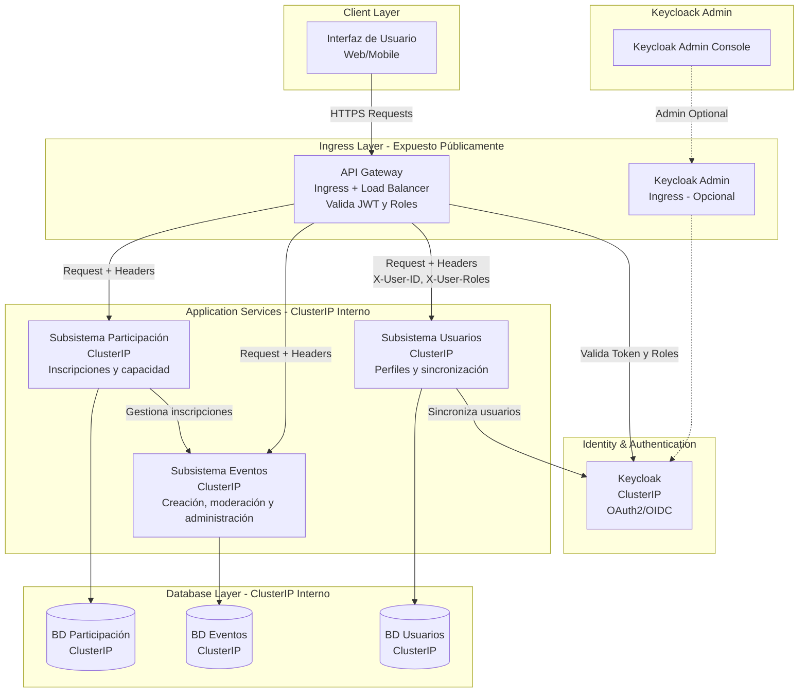

```mermaid
graph TB
    subgraph "Client Layer"
        UI[Interfaz de Usuario<br/>Web/Mobile]
    end
    
    subgraph "Keycloack Admin"
        UI_IDP[Keycloak Admin Console]
    end
    
    subgraph "Ingress Layer - Expuesto Públicamente"
        GW[API Gateway<br/>Ingress + Load Balancer<br/>Valida JWT y Roles]
        KC_IN[Keycloak Admin<br/>Ingress - Opcional]
    end
    
    subgraph "Identity & Authentication"
        IDP[Keycloak<br/>ClusterIP<br/>OAuth2/OIDC]
    end
    
    subgraph "Application Services - ClusterIP Interno"
        US[Subsistema Usuarios<br/>ClusterIP<br/>Perfiles y sincronización]
        ES[Subsistema Eventos<br/>ClusterIP<br/>Creación, moderación y administración]
        PS[Subsistema Participación<br/>ClusterIP<br/>Inscripciones y capacidad]
    end
    
    subgraph "Database Layer - ClusterIP Interno"
        BDUS[(BD Usuarios<br/>ClusterIP)]
        BDES[(BD Eventos<br/>ClusterIP)]
        BDPS[(BD Participación<br/>ClusterIP)]
    end
    
    UI -->|HTTPS Requests| GW
    UI_IDP -.->|Admin Optional| KC_IN
    
    GW -->|Valida Token y Roles| IDP
    GW -->|Request + Headers<br/>X-User-ID, X-User-Roles| US
    GW -->|Request + Headers| ES
    GW -->|Request + Headers| PS
    
    KC_IN -.-> IDP
    
    US -->|Sincroniza usuarios| IDP
    PS -->|Gestiona inscripciones| ES
    
    US --> BDUS
    ES --> BDES
    PS --> BDPS
```