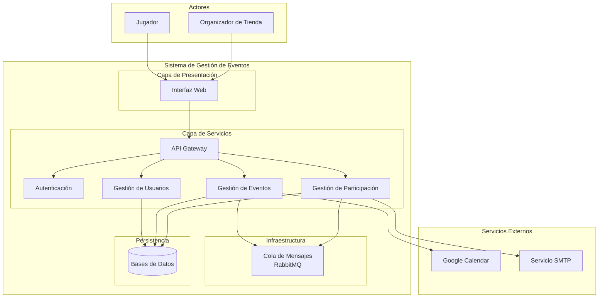

```mermaid
graph TB
    subgraph "Actores"
        JUGADOR[Jugador]
        ORG[Organizador de Tienda]
    end
    
    subgraph "Sistema de Gestión de Eventos"
        
        subgraph "Capa de Presentación"
            WEB[Interfaz Web]
        end
        
        subgraph "Capa de Servicios"
            API[API Gateway]
            AUTH[Autenticación]
            USUARIOS[Gestión de Usuarios]
            EVENTOS[Gestión de Eventos]
            PARTICIPACION[Gestión de Participación]
        end
        
        subgraph "Infraestructura"
            QUEUE[Cola de Mensajes<br/>RabbitMQ]
        end
        
        subgraph "Persistencia"
            DB[(Bases de Datos)]
        end
    end
    
    subgraph "Servicios Externos"
        CALENDAR[Google Calendar]
        EMAIL[Servicio SMTP]
    end
    
    JUGADOR --> WEB
    ORG --> WEB
    
    WEB --> API
    API --> AUTH
    API --> USUARIOS
    API --> EVENTOS
    API --> PARTICIPACION
    
    EVENTOS --> QUEUE
    PARTICIPACION --> QUEUE
    
    EVENTOS --> CALENDAR
    PARTICIPACION --> EMAIL
    
    USUARIOS --> DB
    EVENTOS --> DB
    PARTICIPACION --> DB
```
